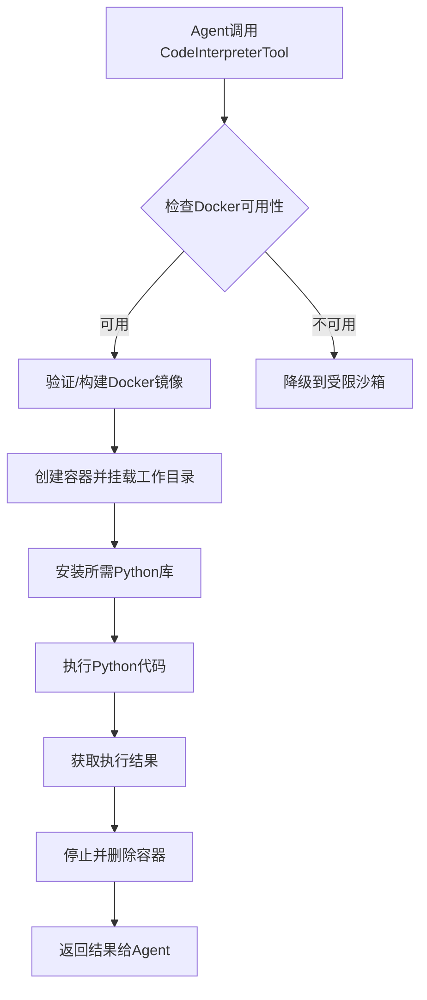

# CrewAI 沙箱执行环境详解 - Agent开发者指南

## 概述

CrewAI 的沙箱执行环境（Sandbox Execution Environment）是一个安全、隔离的代码执行系统，允许 Agent 自主生成并执行 Python 代码。该系统提供了多层安全保护机制，确保即使执行不可信的代码也不会对主机系统造成危害。

## 核心组件

### 1. CodeInterpreterTool - 代码解释器工具

`CodeInterpreterTool` 是 CrewAI 提供的核心工具，位于 `crewai-tools` 包中。它提供了三种代码执行模式：

#### 执行模式对比

| 模式 | 安全性 | 使用场景 | 限制 |
|------|--------|----------|------|
| **Docker容器模式** | ⭐⭐⭐⭐⭐ 最高 | 生产环境推荐 | 需要Docker环境 |
| **受限沙箱模式** | ⭐⭐⭐ 中等 | Docker不可用时的备选 | 功能受限，无法安装库 |
| **不安全模式** | ⭐ 最低 | 仅限可信环境 | 无限制，直接执行 |

### 2. SandboxPython - 受限沙箱类

`SandboxPython` 类实现了受限的 Python 执行环境，当 Docker 不可用时作为备选方案。

#### 安全机制

**被阻止的模块（BLOCKED_MODULES）:**
```python
{
    "os",        # 操作系统接口
    "sys",       # 系统特定参数和函数
    "subprocess", # 子进程管理
    "shutil",    # 高级文件操作
    "importlib", # 导入机制
    "inspect",   # 自省功能
    "tempfile",  # 临时文件
    "sysconfig", # 系统配置
    "builtins",  # 内置函数命名空间
}
```

**被阻止的内置函数（UNSAFE_BUILTINS）:**
```python
{
    "exec",      # 动态执行代码
    "eval",      # 表达式求值
    "open",      # 文件操作
    "compile",   # 代码编译
    "input",     # 用户输入
    "globals",   # 全局变量访问
    "locals",    # 局部变量访问
    "vars",      # 对象属性字典
    "help",      # 帮助系统
    "dir",       # 目录列表
}
```

#### 受限导入机制

`SandboxPython.restricted_import()` 方法拦截所有导入操作，检查模块是否在被阻止列表中：

```python
@staticmethod
def restricted_import(name: str, ...) -> ModuleType:
    if name in SandboxPython.BLOCKED_MODULES:
        raise ImportError(f"Importing '{name}' is not allowed.")
    return __import__(name, ...)
```

#### 安全内置函数字典

`SandboxPython.safe_builtins()` 创建一个过滤后的内置函数字典，移除了所有不安全的函数，并用受限的 `__import__` 替换原始导入函数。

## 执行流程详解

### Docker容器模式（推荐）



#### 关键步骤

1. **Docker镜像验证** (`_verify_docker_image`)
   - 检查镜像 `code-interpreter:latest` 是否存在
   - 如果不存在，使用默认或用户提供的 Dockerfile 构建镜像
   - 默认镜像基于 `python:3.12-alpine`，预装了 `requests` 和 `beautifulsoup4`

2. **容器初始化** (`_init_docker_container`)
   - 创建名为 `code-interpreter` 的容器
   - 将当前工作目录挂载到容器的 `/workspace`
   - 容器以分离模式运行，保持 TTY

3. **库安装** (`_install_libraries`)
   - 在容器内使用 `pip install` 安装 Agent 指定的库
   - 支持安装任意 Python 包（在容器内，安全隔离）

4. **代码执行**
   - 使用 `container.exec_run(["python3", "-c", code])` 执行代码
   - 捕获标准输出和错误输出

5. **清理**
   - 执行完成后立即停止并删除容器
   - 确保每次执行都在干净的环境中

### 受限沙箱模式（备选）

当 Docker 不可用时，系统自动降级到受限沙箱：

```python
def run_code_in_restricted_sandbox(code: str) -> str:
    Printer.print("Running code in restricted sandbox", color="yellow")
    exec_locals: dict[str, Any] = {}
    try:
        SandboxPython.exec(code=code, locals_=exec_locals)
        return exec_locals.get("result", "No result variable found.")
    except Exception as e:
        return f"An error occurred: {e!s}"
```

**限制说明：**
- ❌ 无法安装新的 Python 库
- ❌ 无法访问文件系统（`os`, `open` 被阻止）
- ❌ 无法执行系统命令（`subprocess` 被阻止）
- ✅ 可以使用标准库中的安全模块（如 `math`, `json`, `datetime`）
- ✅ 可以执行纯计算代码

### 不安全模式（不推荐）

仅在完全可信的环境中使用：

```python
def run_code_unsafe(code: str, libraries_used: list[str]) -> str:
    Printer.print("WARNING: Running code in unsafe mode", color="bold_magenta")
    # 直接在主机上安装库
    for library in libraries_used:
        os.system(f"pip install {library}")
    
    # 直接执行代码，无任何限制
    exec(code, {}, exec_locals)
```

**警告：** 此模式会：
- 直接在主机系统上安装包
- 允许执行任意系统命令
- 可以访问和修改主机文件系统
- 可能导致系统损坏或数据泄露

## Agent 集成方式

### 方式一：直接添加工具

```python
from crewai import Agent, Task, Crew
from crewai_tools import CodeInterpreterTool

# 创建代码解释器工具
code_interpreter = CodeInterpreterTool()

# 创建使用该工具的 Agent
data_analyst = Agent(
    role="数据分析师",
    goal="使用Python代码分析和可视化数据",
    backstory="你是一位擅长使用Python处理大型数据集的数据分析专家",
    tools=[code_interpreter],  # 添加工具
    verbose=True,
)
```

### 方式二：启用代码执行标志

```python
from crewai import Agent

# 使用 allow_code_execution 标志自动添加 CodeInterpreterTool
programmer_agent = Agent(
    role="Python程序员",
    goal="编写并执行Python代码解决问题",
    backstory="一位能够编写高效代码解决复杂问题的Python专家",
    allow_code_execution=True,  # 自动添加 CodeInterpreterTool
    verbose=True,
)
```

**内部实现：**
```python
# 在 Agent 核心代码中
def get_code_execution_tools(self) -> list[CodeInterpreterTool]:
    unsafe_mode = self.code_execution_mode == "unsafe"
    return [CodeInterpreterTool(unsafe_mode=unsafe_mode)]
```

### 方式三：自定义配置

```python
from crewai_tools import CodeInterpreterTool

# 使用自定义 Dockerfile
code_interpreter = CodeInterpreterTool(
    user_dockerfile_path="/path/to/custom/Dockerfile"
)

# 指定 Docker 守护进程地址（适用于远程Docker）
code_interpreter = CodeInterpreterTool(
    user_docker_base_url="tcp://192.168.1.100:2375",
    user_dockerfile_path="/path/to/custom/Dockerfile"
)

# 启用不安全模式（仅限开发/测试）
code_interpreter = CodeInterpreterTool(unsafe_mode=True)
```

## 工具参数说明

### CodeInterpreterTool 初始化参数

| 参数 | 类型 | 默认值 | 说明 |
|------|------|--------|------|
| `user_dockerfile_path` | `str \| None` | `None` | 自定义 Dockerfile 路径 |
| `user_docker_base_url` | `str \| None` | `None` | Docker 守护进程 URL |
| `unsafe_mode` | `bool` | `False` | 是否启用不安全模式 |
| `default_image_tag` | `str` | `"code-interpreter:latest"` | Docker 镜像标签 |

### Agent 调用时的参数

Agent 在调用工具时需要提供：

- **code** (必需): Python3 代码字符串
  ```python
  code = """
  import numpy as np
  data = np.array([1, 2, 3, 4, 5])
  result = np.mean(data)
  print(f"平均值: {result}")
  """
  ```

- **libraries_used** (可选): 需要安装的库列表
  ```python
  libraries_used = ["numpy", "pandas", "matplotlib"]
  ```

## 安全考虑

### Docker 容器模式的安全性

✅ **优点：**
- 完全隔离的执行环境
- 容器销毁后不留痕迹
- 可以安装任意库而不影响主机
- 文件系统访问限制在挂载目录内

⚠️ **注意事项：**
- 容器可以访问挂载的工作目录
- 敏感文件如果在工作目录中可能被访问
- 容器内的网络访问不受限制

### 受限沙箱模式的安全性

✅ **优点：**
- 无需 Docker，轻量级
- 阻止了危险模块和函数
- 适合执行纯计算任务

⚠️ **限制：**
- 无法安装新库，功能受限
- 不是完全隔离（仍在主机进程内）
- 某些绕过技术可能仍然有效

### 最佳实践建议

1. **生产环境：** 始终使用 Docker 容器模式
2. **开发环境：** 可以使用受限沙箱模式进行快速测试
3. **敏感数据：** 避免在工作目录中放置敏感文件
4. **库管理：** 审查 Agent 请求安装的库
5. **监控：** 记录所有代码执行操作
6. **资源限制：** 考虑为 Docker 容器设置 CPU/内存限制

## 实际使用示例

### 示例 1：数据分析任务

```python
from crewai import Agent, Task, Crew, Process
from crewai_tools import CodeInterpreterTool

# 创建工具
code_interpreter = CodeInterpreterTool()

# 创建 Agent
data_analyst = Agent(
    role="数据分析师",
    goal="分析数据并生成可视化报告",
    backstory="擅长使用Python进行数据分析和可视化",
    tools=[code_interpreter],
    verbose=True,
)

# 创建任务
analysis_task = Task(
    description="""
    编写Python代码完成以下任务：
    1. 生成包含100个数据点的随机数据集（x, y坐标）
    2. 计算x和y之间的相关系数
    3. 创建散点图并保存为 'scatter.png'
    4. 打印相关系数
    
    确保处理所有必要的导入并打印结果。
    """,
    expected_output="相关系数和散点图保存确认",
    agent=data_analyst,
)

# 运行
crew = Crew(
    agents=[data_analyst],
    tasks=[analysis_task],
    verbose=True,
    process=Process.sequential,
)

result = crew.kickoff()
```

### 示例 2：数学计算任务

```python
from crewai import Agent, Task, Crew
from crewai_tools import CodeInterpreterTool

math_agent = Agent(
    role="数学计算专家",
    goal="执行复杂的数学计算",
    backstory="精通各种数学计算和算法",
    allow_code_execution=True,  # 自动启用代码执行
    verbose=True,
)

calculation_task = Task(
    description="""
    编写Python函数计算斐波那契数列的前10个数字并打印结果。
    """,
    expected_output="斐波那契数列的前10个数字",
    agent=math_agent,
)

crew = Crew(
    agents=[math_agent],
    tasks=[calculation_task],
    verbose=True,
)

result = crew.kickoff()
```

## 故障排查

### 问题 1: Docker 不可用

**症状：** 看到 "Running code in restricted sandbox" 消息

**解决方案：**
1. 安装 Docker: `https://docs.docker.com/get-docker/`
2. 确保 Docker 守护进程运行: `docker info`
3. 检查 Docker 权限（Linux 可能需要将用户添加到 docker 组）

### 问题 2: Docker 镜像构建失败

**症状：** `FileNotFoundError: Dockerfile not found`

**解决方案：**
1. 检查 `crewai_tools` 包是否正确安装
2. 提供自定义 Dockerfile 路径
3. 检查 Dockerfile 语法是否正确

### 问题 3: 库安装失败

**症状：** 代码执行时出现 `ModuleNotFoundError`

**可能原因：**
- 库名称拼写错误
- 库在受限沙箱模式下无法安装（Docker 不可用时）
- 网络问题导致 pip 安装失败

**解决方案：**
- 确保 Docker 可用（允许安装库）
- 检查库名称是否正确
- 检查网络连接

### 问题 4: 代码执行超时

**症状：** 代码执行时间过长或挂起

**解决方案：**
- 为 Docker 容器设置超时限制
- 优化代码逻辑
- 检查是否有无限循环

## 架构设计要点

### 1. 分层安全策略

```
┌─────────────────────────────────────┐
│   Agent 生成的代码（不可信）          │
└──────────────┬──────────────────────┘
               │
               ▼
┌─────────────────────────────────────┐
│   CodeInterpreterTool                │
│   - 参数验证                         │
│   - 执行模式选择                     │
└──────────────┬──────────────────────┘
               │
       ┌───────┴────────┐
       │                │
       ▼                ▼
┌─────────────┐  ┌──────────────┐
│ Docker容器   │  │ 受限沙箱      │
│ (完全隔离)   │  │ (模块限制)    │
└─────────────┘  └──────────────┘
```

### 2. 执行环境选择逻辑

```python
def run_code_safety(self, code: str, libraries_used: list[str]) -> str:
    if self.unsafe_mode:
        return self.run_code_unsafe(code, libraries_used)
    
    if self._check_docker_available():
        return self.run_code_in_docker(code, libraries_used)
    
    return self.run_code_in_restricted_sandbox(code)
```

### 3. 错误处理机制

- Docker 执行失败 → 返回错误信息，不降级到不安全模式
- 沙箱执行失败 → 捕获异常并返回友好错误消息
- 代码语法错误 → 在相应环境中执行并返回 Python 错误信息

## 扩展和定制

### 自定义 Dockerfile

创建自定义 Dockerfile 以包含特定依赖：

```dockerfile
FROM python:3.12-alpine

# 安装系统依赖
RUN apk add --no-cache gcc g++ make

# 安装 Python 库
RUN pip install numpy pandas matplotlib scipy scikit-learn

WORKDIR /workspace
```

使用方式：
```python
code_interpreter = CodeInterpreterTool(
    user_dockerfile_path="./custom.Dockerfile"
)
```

### 扩展 SandboxPython

如果需要自定义受限模块列表：

```python
# 继承并扩展
class CustomSandboxPython(SandboxPython):
    BLOCKED_MODULES = SandboxPython.BLOCKED_MODULES | {
        "socket",  # 添加网络访问限制
        "urllib",  # 添加URL访问限制
    }
```

## 总结

CrewAI 的沙箱执行环境为 Agent 开发者提供了一个强大而安全的代码执行解决方案：

1. **多层安全保护：** Docker 容器 + 受限沙箱双重保障
2. **灵活的执行模式：** 根据环境自动选择最佳执行方式
3. **易于集成：** 简单的 API，支持多种集成方式
4. **可扩展性：** 支持自定义 Dockerfile 和配置
5. **完善的错误处理：** 友好的错误消息和降级策略

对于 Agent 开发者来说，这个系统让 Agent 能够：
- 自主生成代码解决复杂问题
- 在安全环境中执行代码
- 获取执行结果并用于决策
- 无需担心代码执行带来的安全风险

通过合理使用这个工具，可以大大扩展 Agent 的能力边界，使其能够处理需要计算、数据分析、算法实现等任务。
