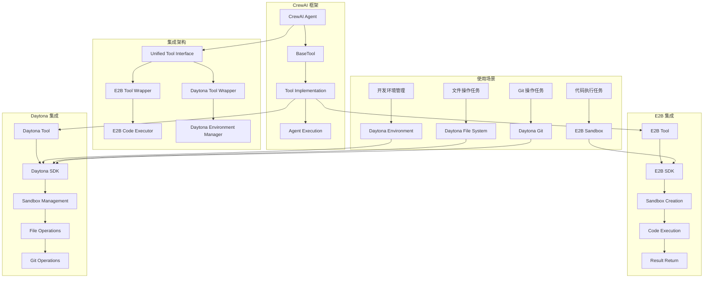
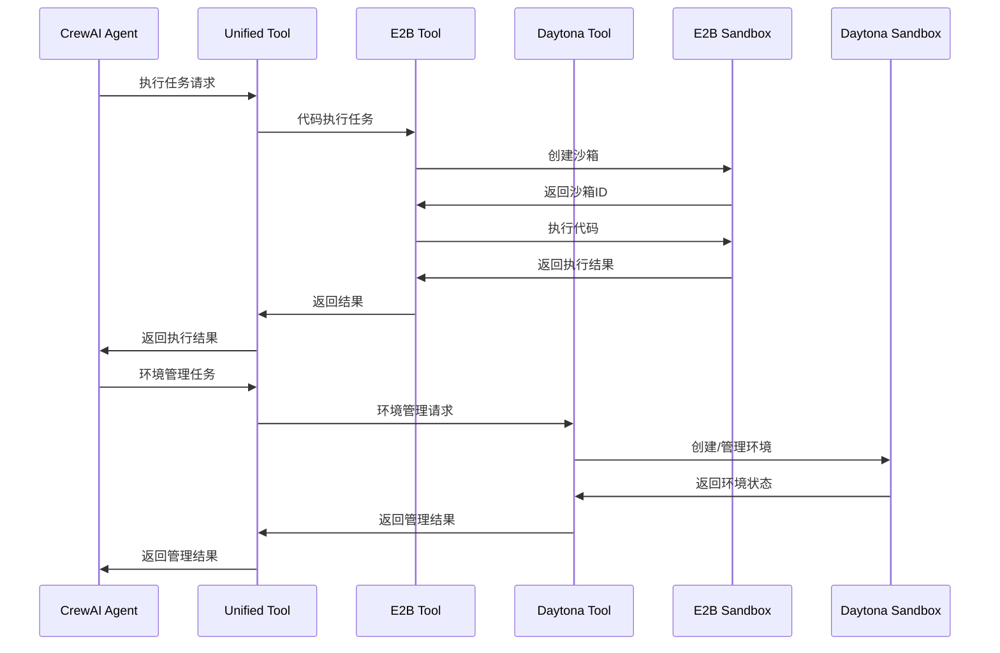
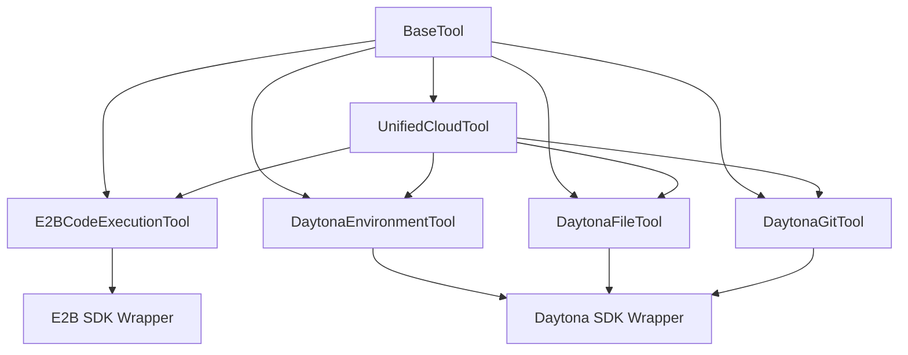
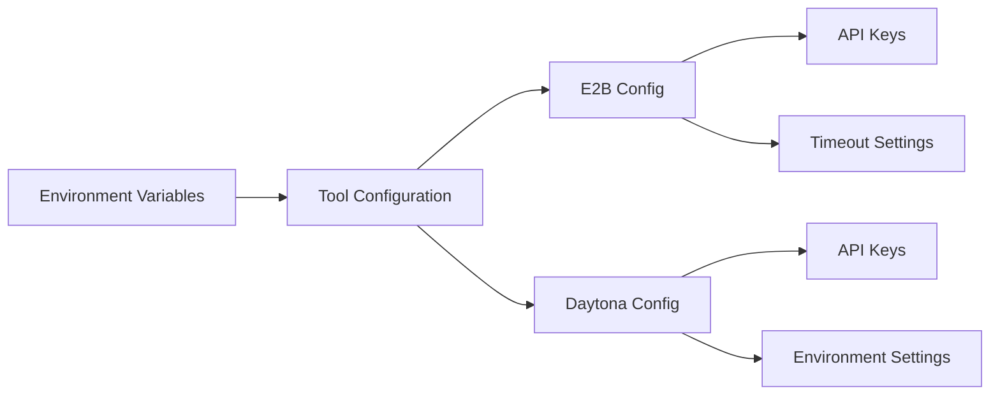
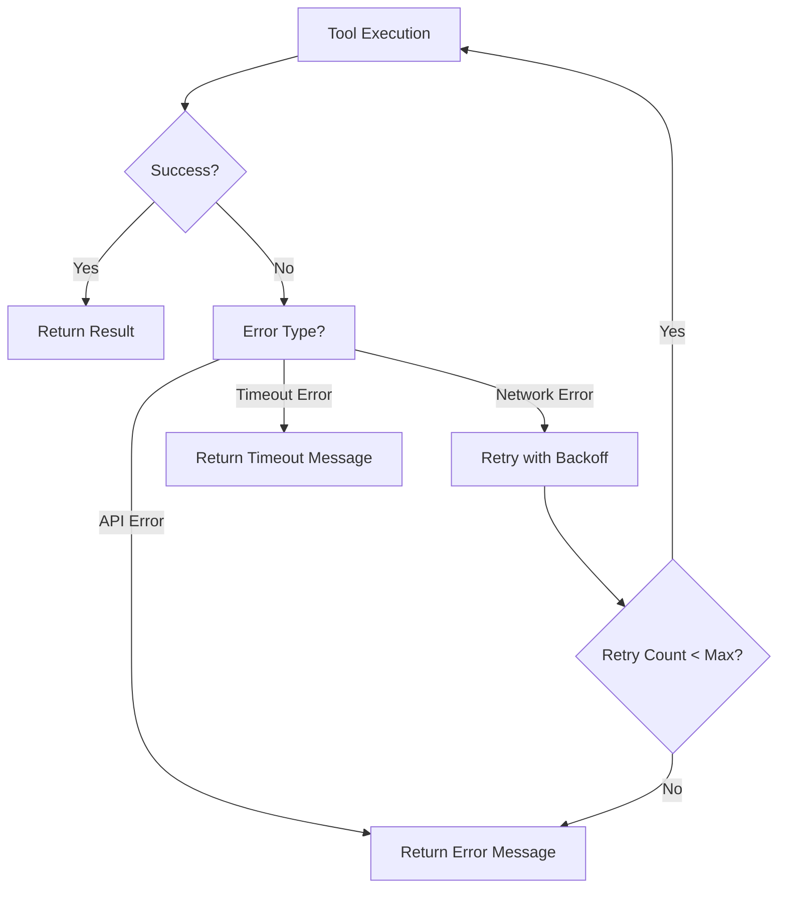
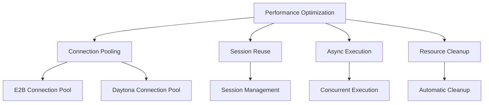

# CrewAI 与 E2B、Daytona 集成架构图

## 系统架构图

## 数据流图

## 工具层次结构

## 配置管理

## 错误处理流程

## 性能优化策略

这个架构图展示了 CrewAI 与 E2B、Daytona 的完整集成方案，包括：

1. **系统架构**: 展示各组件之间的关系
2. **数据流**: 展示任务执行的完整流程
3. **工具层次**: 展示工具的组织结构
4. **配置管理**: 展示配置的管理方式
5. **错误处理**: 展示错误处理流程
6. **性能优化**: 展示性能优化策略